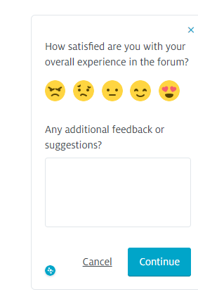
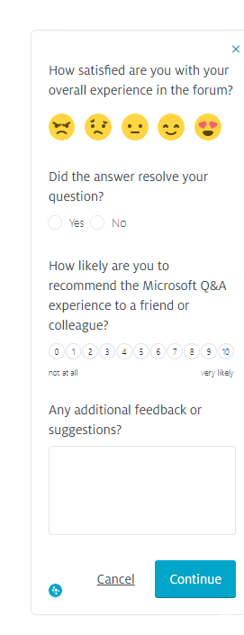

# View results of the Microsoft Q&A CSAT surveys
### Overview:
On Microsoft Q&A, we are using two different surveys to track customer satisfaction with the platform: 
1. **Sampled visitor survey:** This survey is triggered for 30% of all users who:
  a. Scroll down to 500 pixels from the bottom of the page they are on
  b. Have been on Q&A for 1 minute 

2. **Original poster (OP) survey:** This survey is triggered for 100% of users who:
  a. Ask a question and navigate away from the page
  b. Return to the question page 

> [!NOTE]
> You will **not** be notified of a survey response if you answer a question. The original poster's survey response will not impact your Microsoft Q&A reputation points.  

 Both of these surveys have been created using a third-party survey service, [Usabilla](https://usabilla.com/). 

### How will this affect me?
You will only be affected by these surveys if you're a user that matches the user targeting criteria for either survey listed above. If you want to use the results of these surveys to gauge forum health, see the next section.

### How can I see the results of these surveys?
We are currently working on exporting the results of the two surveys into an easily digestible dashboard; this is expected in February 2020. 

In the meantime, you can still view the responses to the surveys! By calling Usabilla's API, you will receive a JSON with the raw survey data that can then be processed. You can find information on how to call the Usabilla API and process the results [here](https://developers.usabilla.com/?python#get-campaign-results).

> [!IMPORTANT] Below are the Usabilla API keys:
  **Client access key:** 2a7c2709b54518cc
  **Secret key:** fb818fe2c03280a9427c

Once the results are available in a dashboard format, this document will be updated with access instructions, and an email announcement will be sent out.

### Have additional questions or concerns?
Please contact Alli Greubel (algreube) if you have any issues or questions about the surveys.
