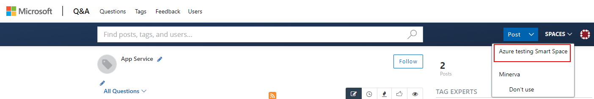
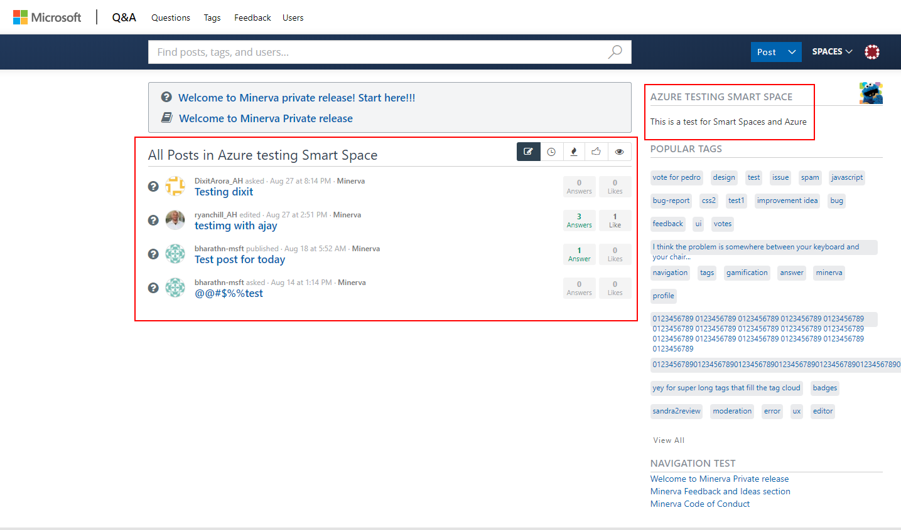

# Hub pages in Microsoft Q&A

We need to make sure that customers stay focus on their area of interest. For that, we wil use Smart Spaces in AnswerHub.

We are experimenting with Smart Spaces for Azure.

## Introduction to Smart Spaces

Smart Spaces pull together content based on filters related to different tags, users, content types, and search queries to display on a single page of the AnswerHub User Interface (UI). They are used as an additional form of organization within an AnswerHub community and are especially useful for browsing a mixture of content from multiple spaces.

Note: Users are not able to post content in a Smart Space, all content that appears in a Smart Space is populated from other Spaces in the community and based on pre-set filters.

### Capabilities

- A Smart Space is an aggregation of content of other spaces based on rules.
- It is a virtualized space.
- It appears in the drop-down space together with other spaces.
- It has its own URL.
- It can have different CSS styles.
- It can have an icon.

### Smart Space Limitations

- A Smart Space is not permission controlled. So, we cannot have further permissions than the space.
- It does not have a breadcrumb trail as it is not a physical container.
- We cannot show sticky content only for the smart space. You will see the site sticky posts.
- It provides a feed of the aggregated content. Te rest of the page does not change. For example, "Popular Tags" apply to the full site, not just to the tags include Smart Space.
- Search is not scoped for the Smart Space, it is Search wide.
- Its content does not live in the smart space.

## Smart Space Requirements

A Smart Space matches Docs Hub pages and hierarchy.

## User Experience

> [!NOTE]
> We are using a [sample test](https://demo.forums.docs.microsoft.com/smart-spaces/11/azure-testing-smart-space.html) that we have done for Azure in the private environment. 
> We have created some tags that have "azure" as our parent

A user can navigate to the Smart Space via the "Spaces" navigation in the blue bar. The Smart Space will appear on top:

When the user clicks on it, the user is taken to the Smart Space. Only the navigation and the description on top left is from the Smart Space. Everything else is from the Site.

### Smart Space Resources

- [AnswerHug topics (tags) and Smart Spaces](https://developer.devada.com/docs/topics)
- [Admin guide to Smart Spaces](https://developer.devada.com/docs/site-structure-menu#section-smart-spaces)

