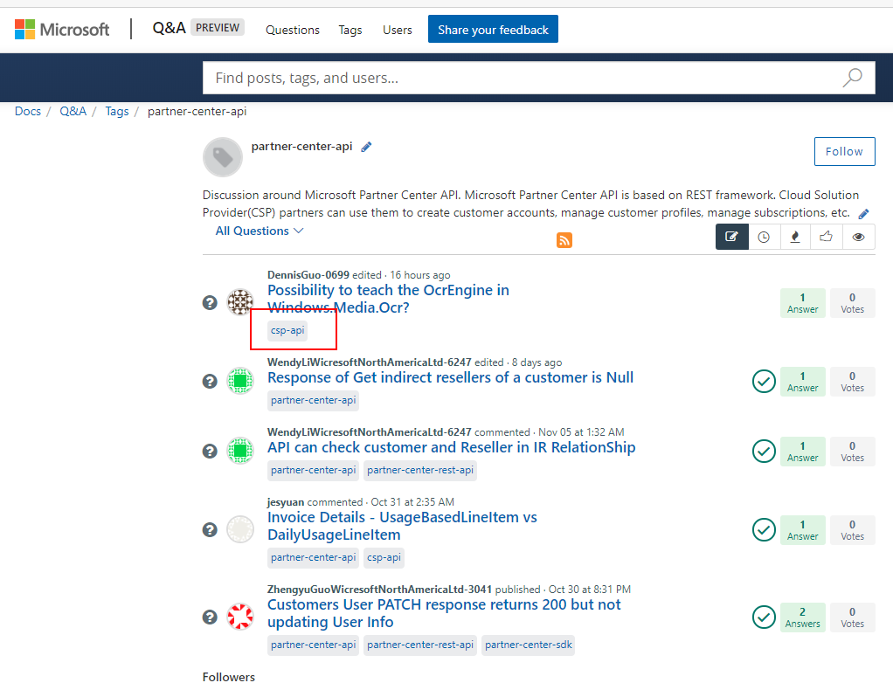

# Tag Creation Guidelines for Public Launch

The scope of this page is only for Q&A public launch on October 30. We will update this process with better recommendations based on the learnings that we have go through this first launch.

## Guidelines when creating tags for Microsoft Q&A launch

- Create a spreadsheet with all the tag elements: Parent, children, name, description (optional), and icon (optional). An example is [UWP](https://microsoft.sharepoint.com/teams/CE_APEX/Documents/APEX%20Online%20Team/Minerva/Public%20Launch/UWP.xlsx?web=1).
- If you want icons, please provide the link to the downloadable file.
- Reuse name Docs' slugs already in place in [Docs' taxonomy](https://review.docs.microsoft.com/en-us/new-hope/information-architecture/metadata/taxonomies?branch=master) as much as possible.
- Tags can have many-to-many parent-child relationship. I.e. a tag can be children of multiple parents.
- Use only a two-level hierarchy for tags. I.e. ony parent (L1) and children (L2).
- The path to the parent tag can be uses to send the users to your service. The link to the parent tag contains all the elements that have the parent tag or any of its children. Example: [Partner Center API](https://docs.microsoft.com/answers/topics/partner-center-api.html).

- Tag hierarchy is not visible to the users, so repeat your service name in the L2 tags as needed.
- Provide additional tags based on scenario and tags used in other communities (such as Stack Overflow), your customers are already familiar with.
- If you have more than one service, such as the Azure team, please create a tab per service.

## Tag-naming rules

- Use lowercase only
- Use hyphen between words
- Don't use special characters (except for hyphens)
- Keep "Microsoft" out of the product name, unless there really needs to be an exception
- Make the tag name as compact as possible (ie: short “common-data-service-for-apps” to “common-data-service”).
- No product versions in the tags, unless there really needs to be an exception

## Sending the tags

Send the spreadsheet to [Sandra Aldana](mailto:saldana)

## Resources

- [Product Catalog ACOM docs](https://acom.azure.net/documentation/product-catalog-synchronization-process/)
- [Azure Metadata Repo](https://github.com/Azure/azure-metadata)
