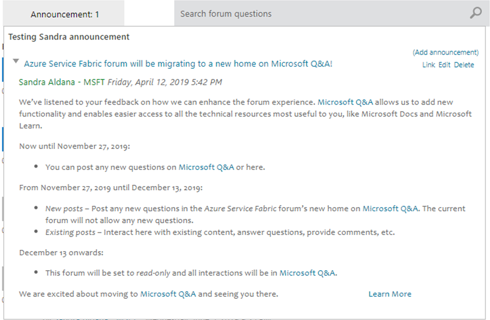
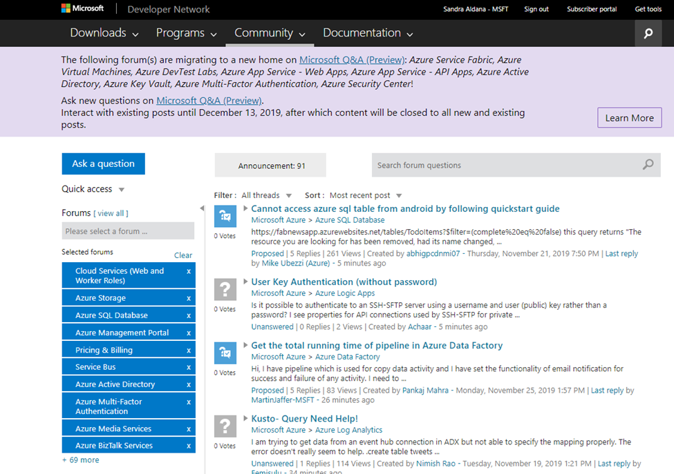
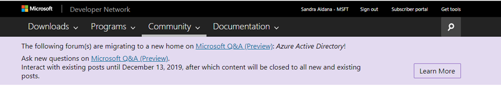
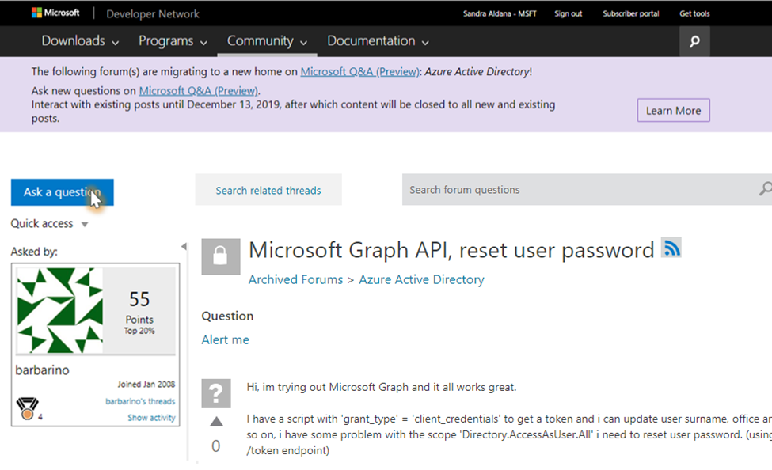
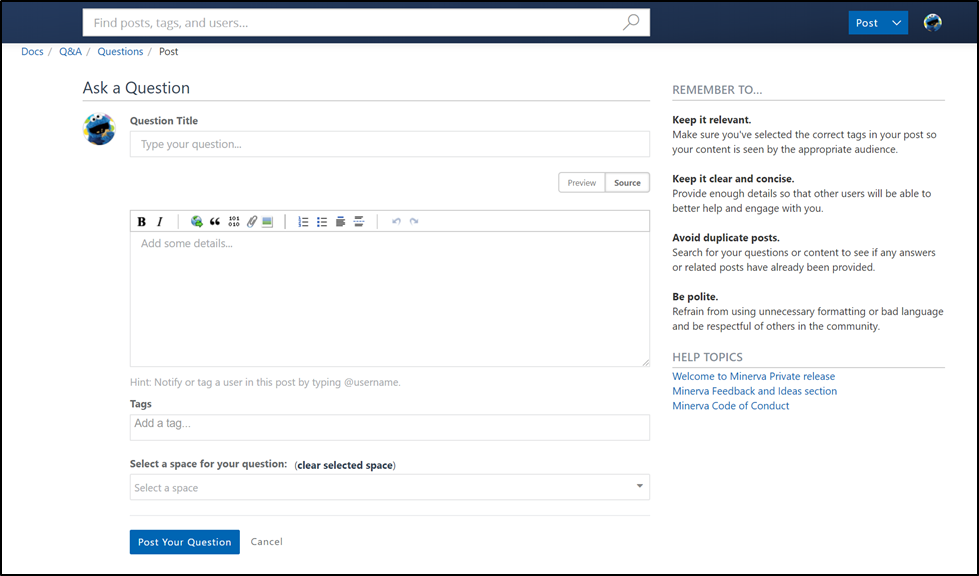
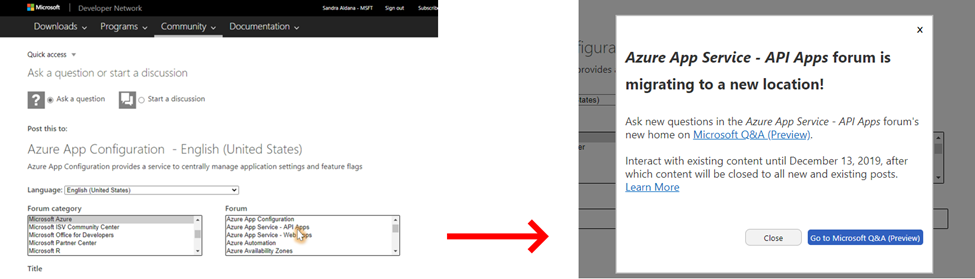
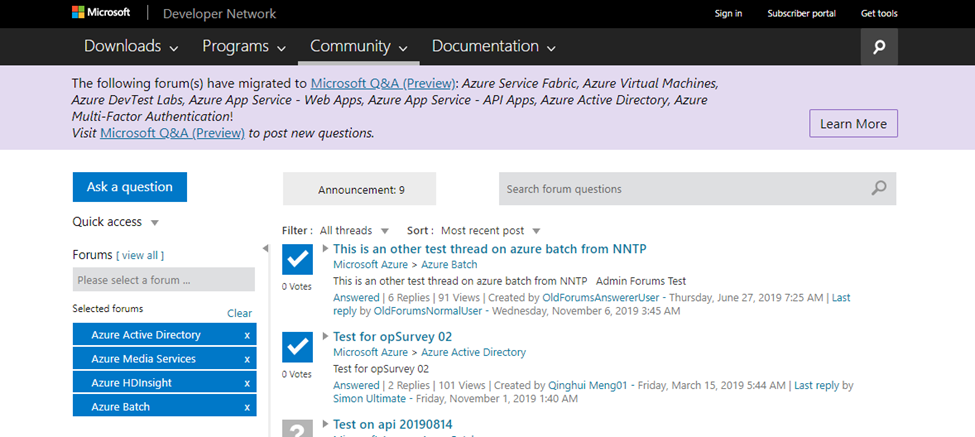
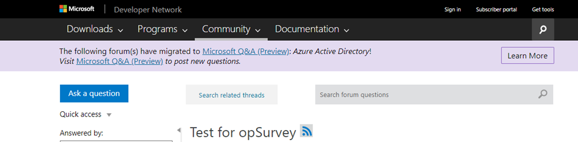

# MSDN and TechNet forums lock down and redirection to Q&A

As we close down MSDN Forums and support those products and services in Q&A, we need to ensure the customers have a smooth experience transitioning to it from MSDN And TechNet forums. This will be a pilot to validate this action is the right one.
The goals of this page are twofold:

1. Define the user experience and journey as we close a forum from MSDN and TechNet supported by Microsoft Q&A.
2. Allow users to close on existing conversations during the transition from MSDN/TechNet forums to Q&A.

## MSDN/TechNet forum shut down plan

"T" = When the MSDN/TechNet forum for a product/service is supported in Q&A.

|Date     |Phase  |
|---------|---------|
|T     | First announcement: Forum will be read-only        |
|T+3 weeks     | Second announcement: Forum does not take new questions. Users can still follow on existing questions.        |
|T+5 weeks     | Third announcement: Forum is read-only        |

> [!IMPORTANT]
> We only support retiring a batch of forums with the same T at a time. In other words, if we're retiring forum A and forum B and they have a different retirement date and the dates is within 6 weeks, we don't support the scenario right now.

Dev Relations will post all the announcements.

* The first announcement will be posted by the Dev Relations PM.
* For the second and third announcement, Dev Relations PM will open a Dev Task for engineering to deploy the code for the forum in scope. Information needed:
   * Forum name
   * Date of deployment
   * Task details

## First announcement: Forum will be read-only

**When**: T

**Where**:  Announcement and/or Sticky Post in the Forum to set up as read-only. Moderators and answerers are also encouraged to add that notification as part of their responses.

<!--
**Message**

*Title:*

{forum-name} forum will be migrating to a new home on [Microsoft Q&A (Preview)](https://docs.microsoft.com/answers?WT.mc_id=msdnredirect-web-msdn)!

*Body:*

We've listened to your feedback on how we can enhance the forum experience. [Microsoft Q&A (Preview)](https://docs.microsoft.com/answers?WT.mc_id=msdnredirect-web-msdn) allows us to add new functionality and enables easier access to all the technical resources most useful to you, like Microsoft Docs and Microsoft Learn.

**Now until {T+3 weeks}:**

* You can post any new questions on Microsoft Q&A (Preview) or here.

**From {T+3 weeks} until {T+5 weeks}:**

* New posts – Post any new questions in the {forum-name} forum's new home on [Microsoft Q&A (Preview)](https://docs.microsoft.com/answers?WT.mc_id=msdnredirect-web-msdn). The current forum will not allow any new questions.
* Existing posts – Interact here with existing content, answer questions, provide comments, etc.

**{T+5 weeks} onwards:**

* This forum will be closed to all new and existing posts and all interactions will be in [Microsoft Q&A (Preview)](https://docs.microsoft.com/answers?WT.mc_id=msdnredirect-web-msdn).
We are excited about moving to [Microsoft Q&A (Preview)](https://docs.microsoft.com/answers?WT.mc_id=msdnredirect-web-msdn) and seeing you there.

[Learn More](https://aka.ms/docsqalearnmore)

-->

**Visual**

## Second announcement: Forum does not accept new questions

**When:** T+3 weeks

At this point, in the forums supported in Q&A Public Preview, users cannot create new questions anymore. Users can still reply to existing threads for another 2 weeks. The forum moderators might be able to help closing the existing discussions quickly.

The following are the user scenarios we are covering.

### Announcing forum read-only allows existing questions

**Where:**

* In the forum's home page, there will be a banner announcing that the forum will be set as read only.
* If the user selects multiple forums, even when only one of the selected forums is set as read-only, the announcement will show in the combined forums page.
* In the category page of any of the forums that are set for closure.
* In every question thread for the forum.

Banner cannot be dismissed.

**Visuals:**

Home page or category page of the forum to set as read-only

From a forum's thread

<!--
**Message**

The following forum(s) are migrating to a new home on [Microsoft Q&A (Preview)](https://docs.microsoft.com/answers?WT.mc_id=msdnredirect-web-msdn): *{forum-name1}*, *{forum-name1}*, ..., *{forum-name-n}*!

Ask new questions on [Microsoft Q&A (Preview)](https://docs.microsoft.com/answers?WT.mc_id=msdnredirect-web-msdn).

Interact with existing posts until {T+ 5 weeks}, after which content will be closed to all new and existing posts.

[Learn More](https://aka.ms/docsqalearnmore)

-->

### Redirect forum's "Ask a question" to Q&A

As users cannot create new questions, While users cannot s cannot create new questions anymore. Users can still reply to existing threads for another 2 weeks.

If the user clicks on **Ask a question** button, they will be sent to Q&A's create a new question page. User might need to log in/sign up for a Tech Profile, despite whether they are logged in MSDN/TechNet or not, as the two systems use different profiles.

**Visual:**

User clicks on Ask a Question on the forum's page

If user does not have an account in Tech Profile yet, they will be asked to create one. Once they are logged in into Q&A, they will land in the create new question page.

### Modal when asking a question in forums home page

If the user is trying to post the question from the Forums home page, when they select the forum we are moving to Q&A, the UI will indicate that the forum is disabled and the user will see a message indicating that the forum is not taking new questions. The message will also have a link to post the question in Q&A.

**Visual:**

User selects the category, when they click on the forum. When they click on it, they will get a modal:

1. If they click on Q&A platform link, user goes to create new page in Q&A in the same browser tab.
2. If they click on Close, the modal closes, and the user is set back to the "Ask a question or start a discussion dialog" form. Ask a question/Start a discussion, Language, and Forum Category user selections are kept.
3. If they click on Learn More, a new window opens with the target link, so the user does not lose their selection.

## Third announcement: Forum is read-only

When: T+5 weeks

### Set MSDN Forum as read only

At this time, the forum is set to read-only, so users cannot take any write action on the forum.
When the forum is set as read-only, any write action in the forum is disabled by default. Our team will:

1. Set forum as: Active and Locked
2. Remove forum owners
3. Move the forum to the Archived category

### Forum is read-only

**Location:**

* In the forum home page.
* In every question thread for the forum.
* In the MSDN and TechNet New Thread pages.
* If the user selects multiple forums, even when only one of the selected forums is set as read-only, the announcement will show in the combined forums page.

Banner cannot be dismissed.

**Visuals:**

Category home page

Forum question thread

MSDN new thread page

:::image type="content" source="media/announcement3-forum-is-read-only-new-thread-msdn.png" alt-text="Announcement in MSDN New Thread":::

TechNet new thread page

:::image type="content" source="media/announcement3-forum-is-read-only-new-thread-technet.png" alt-text="Announcement in TechNet New Thread":::

<!--
**Message**

The following forum(s) have migrated to [Microsoft Q&A (Preview)](https://docs.microsoft.com/answers?WT.mc_id=msdnredirect-web-msdn): *{forum-name1}*, *{forum-name1}*, ..., *{forum-name-n}*!

Visit [Microsoft Q&A (Preview)](https://docs.microsoft.com/answers?WT.mc_id=msdnredirect-web-msdn) to post new questions.

[Learn More](https://aka.ms/docsqalearnmore)

-->