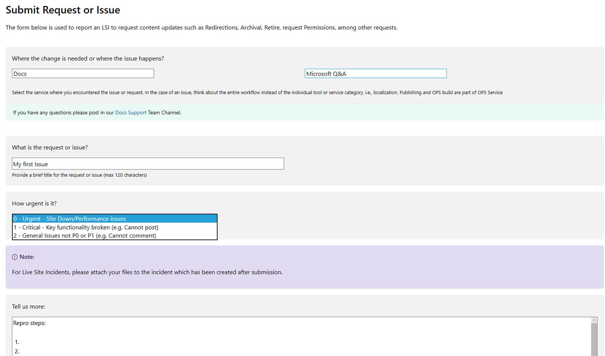

# Reporting issues with the Microsoft Q&A platform

## Platform issues

Please use [SiteHelp](https://aka.ms/sitehelp) for any platform issues such as:

1. Site is down
2. Performance issues
3. Cannot do one of the main write actions: post a question, answer, comment, or feedback.
4. Content goes to moderation by error.
5. Etc.

Once you are in SiteHelp, you will see the following options:

If you are pressed for time (such as the site is down), you can also reach [APEXLS](mailto:APEXLS@microsoft.com).

We highly recommend SiteHelp for logging all issues as it will allow us to properly track and maintain our SLA’s.

## Bugs

If you find bugs on the user experience, such as

1. Content appears in a different language
2. Cannot edit tag description
3. Number of following items do not appear on the site
4. Etc.

Then, you report a bug to the PM team in our DevOps instance. 

1. If you are from Azure, then you use the [Q&A bugs from Azure CXP Community](https://ceapex.visualstudio.com/Engineering/_workitems/create/Bug?templateId=4b271355-2163-4707-af36-6b3b98b7d5c0&ownerId=1e0d3b3c-60b1-45ae-809b-60c7f036b008)
2. If you are from the CSS Developer team, then you use the [Q&A bugs from CSS](https://ceapex.visualstudio.com/Engineering/_workitems/create/Bug?templateId=4cd43e35-bac1-4674-af71-04dceca9fc33&ownerId=1e0d3b3c-60b1-45ae-809b-60c7f036b008).
3. If you are from another team, please enter the bug directly in [Microsoft Q&A - Feedback section](https://docs.microsoft.com/answers/content/idea/list.html)

## Feature requests

If you want to provide improvements in the platform, then you have two options:

1. If you are from Azure CXP Team or CSS Developer, contact [Sandra Aldana](mailto:saldana). We will work with you to enter the feature requests and get them prioritized.
2. If you are from another team, please enter the bug directly in [Microsoft Q&A - Feedback section](https://docs.microsoft.com/answers/content/idea/list.html)
