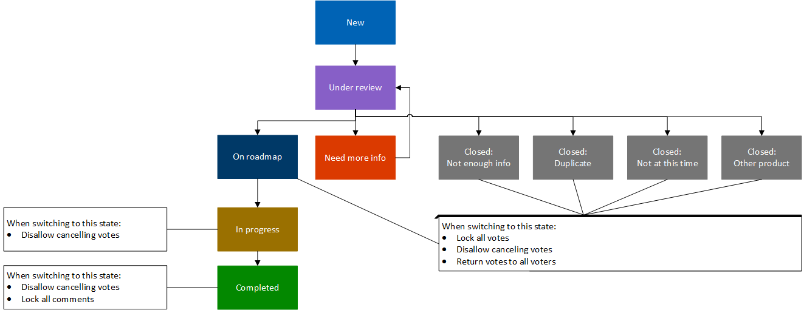

# Site Feedback

You can provide suggestions and give us feedback on Microsoft Q&A on the site. The Microsoft Q&A team will evaluates your feedback in regular basis and provides updates along the way.

Note that this flow only applies for site feedback on Microsoft Q&A. For feedback on any other platform, please continue engaging in the sites you normally do.

## Voting

If you see some feedback already reported by others that you would like implemented, we encourage you to vote on those suggestions to make the most impact on the platform.

Note that you have 10 votes for all site feedback still in evaluation. Once the feedback is picked up or closed, you will get that vote back.

## Feedback Statuses

After you submit an feedback or feedback, states indicate where your feedback or feedback submission is in its lifecycle. As we take your feedback into consideration and move it along the workflow, we tag it with the corresponding states. The various states associated with feature suggestions are listed here, along with a description of their meaning and color indicators.

| Icon  | Description |
| :---------------:  | ----  |
|  | **New** means the feedback has been newly reported by you or someone else. No action has been taken on it yet. The Q&A team will do some preliminary checks to make sure we can proceed further.  |
|  | **Under review** indicates that the feedback has been queued up for prioritization. We prioritize items to bring our broader community the best value, while also taking the product roadmap into consideration.  |
|  | **On roadmap** means that the  feedback has a broad community impact and will help improve the product experience. We've allocated time for it on our roadmap. |
|  | **In progress** means that the feedback has been picked up by our team and we are actively working on it. |
|   | **Completed** indicates that your feedback has been shipped. You should be able see the feedback implemented on the Q&A site. |
| | **Need more info** means that we need more details so we can better understand your feedback. Check the comments, where we'll ask for additional information to get a deeper understanding.  |
|  | **Closed: Not enough info** indicates that after several attempts, we haven’t received enough information to understand your feedback fully. We have to close the item as we're unable to take any further action at this stage.  Found the information we were looking for? You may request to reactivate the ticket when you have the additional information via a comment. |
|   | **Closed: Duplicate** indicates that someone else has already provided the same feedback. Review the comments to find the link to the original feedback and follow it to get updates.   |
|   | **Closed: Not at this time** means that the feedback is not aligned with our current roadmap. Even if we're unable to pursue your feedback at this time, we'll continue to monitor in case the community weighs in, and decide if we will bring it for consideration later on. |
|   | **Closed: Other product** means we're unable to address the feature suggestion at this time because it's not applicable to Q&A. However, we'll provide details on where you can share your suggestion for the appropriate product. |

## Feedback Workflow

Below is the flowchart showing you how your feedback are moved between states.

## Responses for each of the status

- **New** - No response needed. All the ideas get to this state
- **Under review** - Hi {insert customer alias}, thanks for the valuable suggestion. We are currently evaluating it and we will come back to you soon. We thank you for your help evolving the Q&A platform. 
- **On roadmap** - Hi {insert customer alias}. We reviewed your suggestion and we are adding this to our roadmap. We will update this thread with more details to share. We thank you for your help evolving the Q&A platform.
- **In progress** - Hi {insert customer alias}. We wanted to let you know that we have started the implementation of this suggestion. We will update this thread with delivery details. We thank you for your help evolving the Q&A platform.
- **Completed** - Hi {insert customer alias}. We wanted to let you know that we have shipped this feature. {add details about it, documentation, etc}. If you find any issues or have other suggestions, please enter a new feedback item. We thank you for your help evolving the Q&A platform.
- **Need more info** - Hi {insert customer alias}. In order for us to evaluate next steps, we need to better understand your suggestion. Can you provide more feedback on {insert specifics on their suggestion that are not clear or incomplete}. We thank you for your help evolving the Q&A platform.
- **Closed: Not enough info** - Hi {insert customer alias}. Unfortunately, we did not hear from you and we do not have enough information on the current suggestion to move it forward. Once you have the information we were looking for, you may request to reactivate the ticket when you have the additional information via a comment.
- **Closed: Duplicate** - Hi {insert customer alias}. The same suggestion was suggested by another user. We are closing this request and you can follow the status of your suggestion here {insert link to original suggestion}. We are actively working to improve this experience. We thank you for your patience as we evolve the Q&A platform.
- **Closed: Not at this time** - Hi {insert customer alias}, thanks for the valuable suggestion. At this time we aren't pursuing this suggestion due to factors such as lack of product direction alignment or community impact. <Add comments for any additional clarity}. Although we're unable to address this particular issue, be assured that all your feedback is valuable. We thank you for your help evolving the Q&A platform.
- **Closed: Other product** - Hi {insert customer alias}, thanks for the valuable suggestion. This feedback channel is currently reserved for Platform-related suggestions. Please post your suggestion to our feedback channel {insert URL} so the community can comment and vote on it. This allows the respective feature teams to review and prioritize your suggestion against their product backlog.<br}We are actively working to improve this experience. We thank you for your patience as we evolve the Q&A platform.

## Messages for other Misroute scenarios and Redirection steps 

Please see [here](https://microsoft.sharepoint.com/:w:/t/AzureCXPCommunityEngineers/EfMmbYwONoZOj1tsIw9ir40BLXFgmt47PCFbZ5y4xba9rw?e=cykxyz).