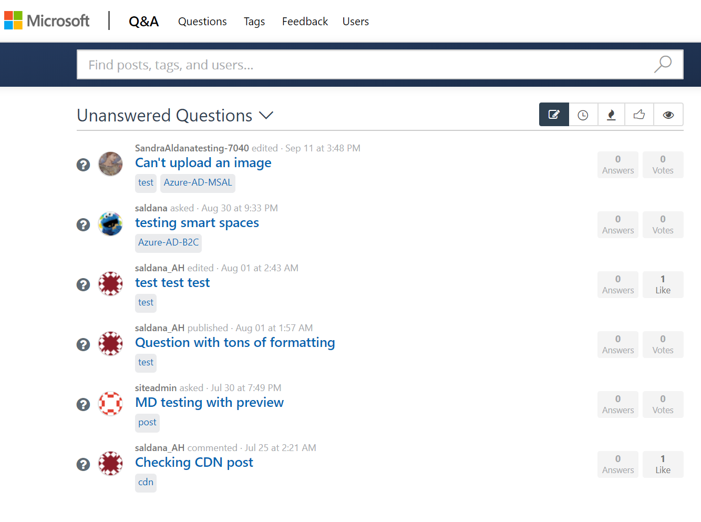
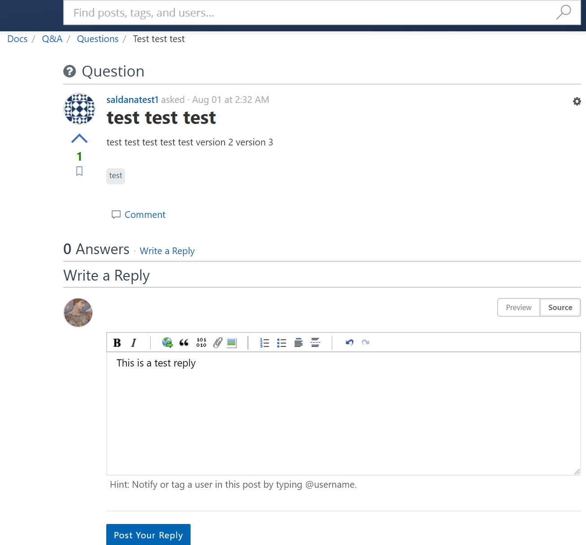
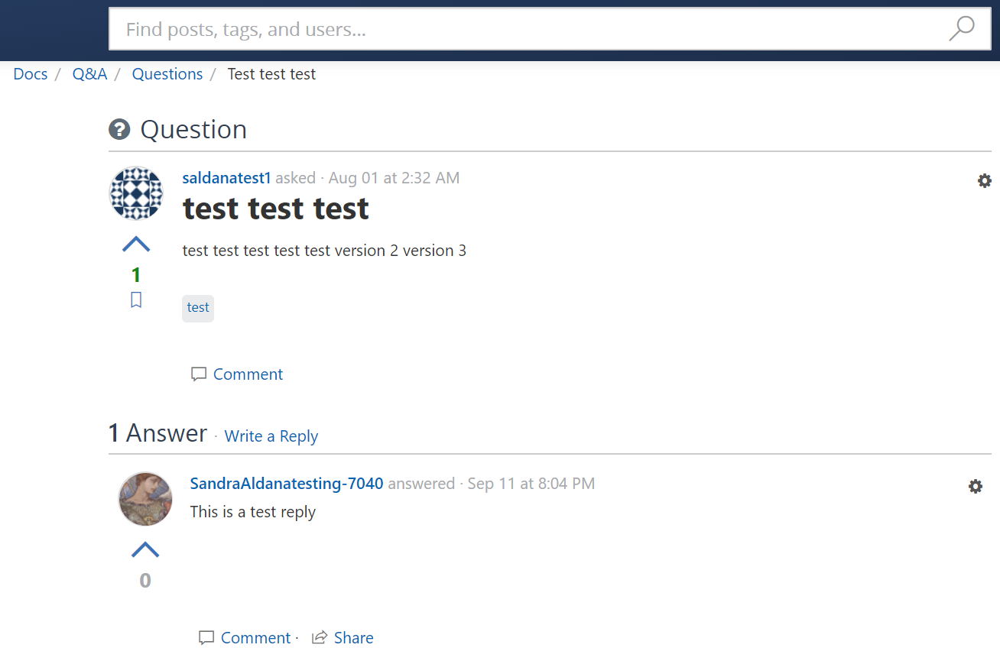
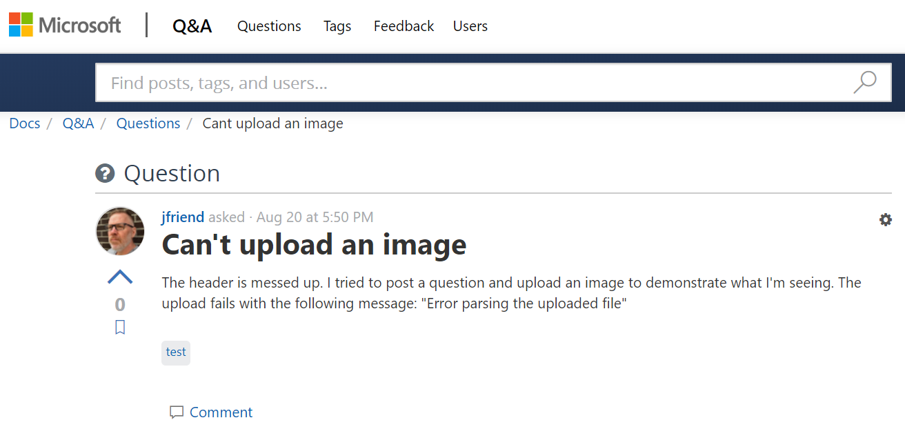
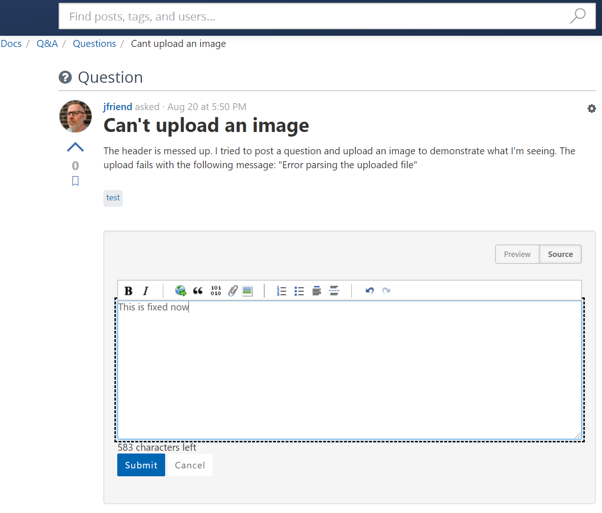
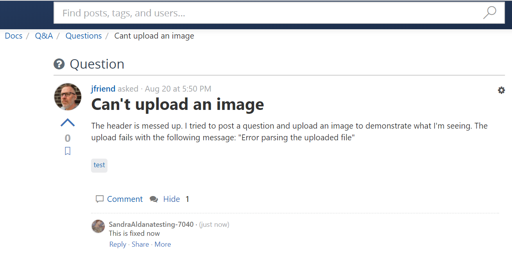
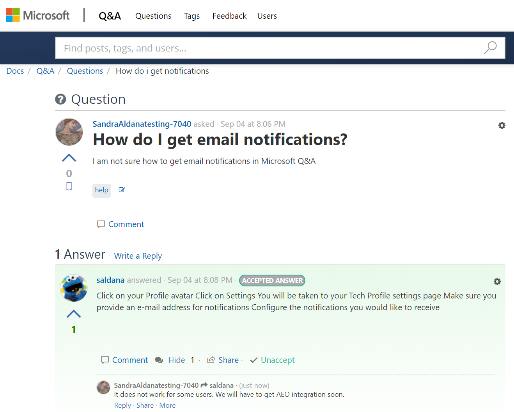

# User Experience for Answerers

> [!IMPORTANT]
> All scenarios assume the user is signed in already. See [Sign in Process](index.md#sign-in-process) for the full workflow.

## Filtering and answering a question

Look for questions that have no answers.

1. Click on "Questions" on the top navigation.
1. Filter by "Unanswered Questions".

The list of questions that need answers is displayed.

3. Locate and open the question to answer.
1. Click on "Write a Reply" link.
1. Enter your answer in the editor.

6. Click on "Post your Reply" button.

**Result**: The reply is posted.

## Commenting on a question

You can use comments when you need to clarify a question from another user. To do that:

1. Locate and open the question.
1. Click the "Comment" link below the question.

1. Enter your comment in the editor.
1. Click the "Submit" button.

**Result**: The comment is displayed below the question.

## Commenting on an answer

To comment on an answer to the question, do the following:

1. Click the "Comment" link below the answer.
1. Enter your comment in editor.
1. Click the "Submit" button.

**Result**: The comment is displayed below the answer.

