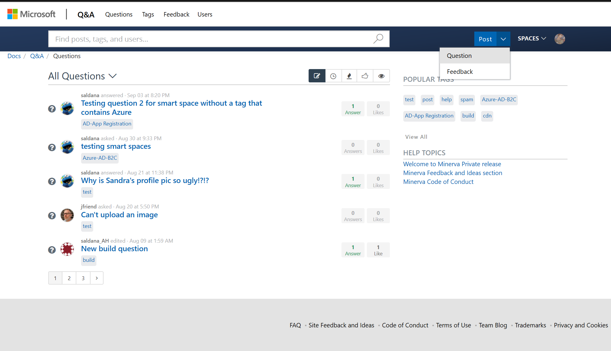
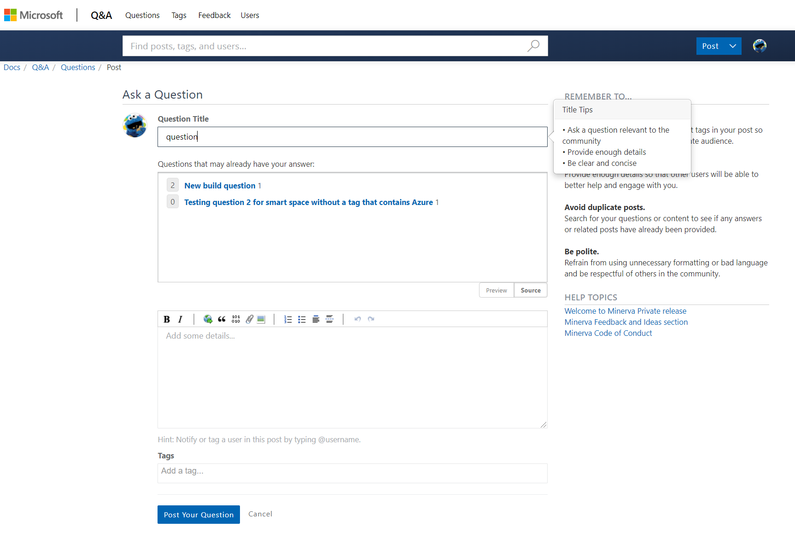
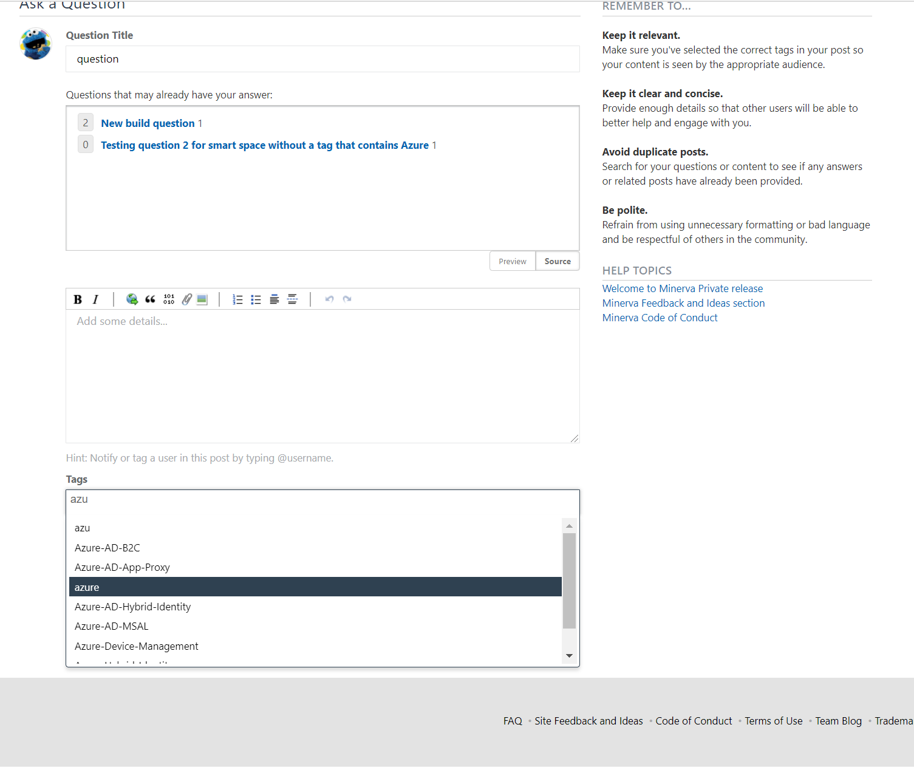
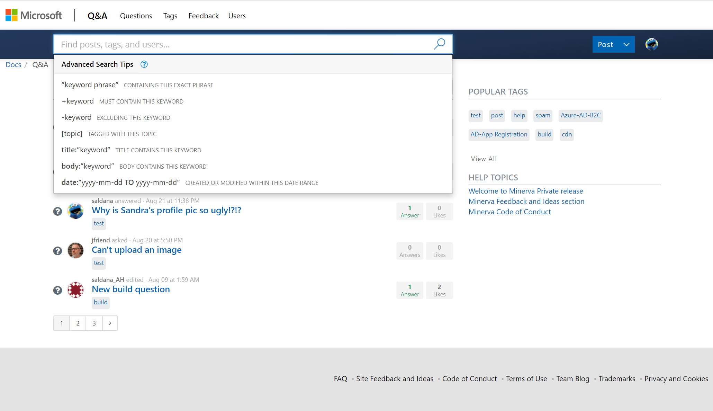
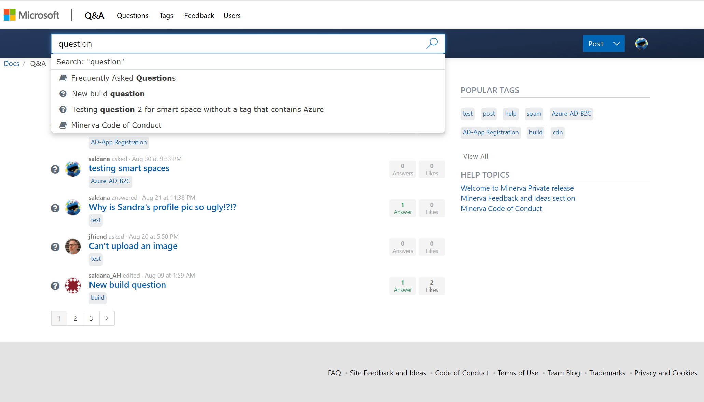
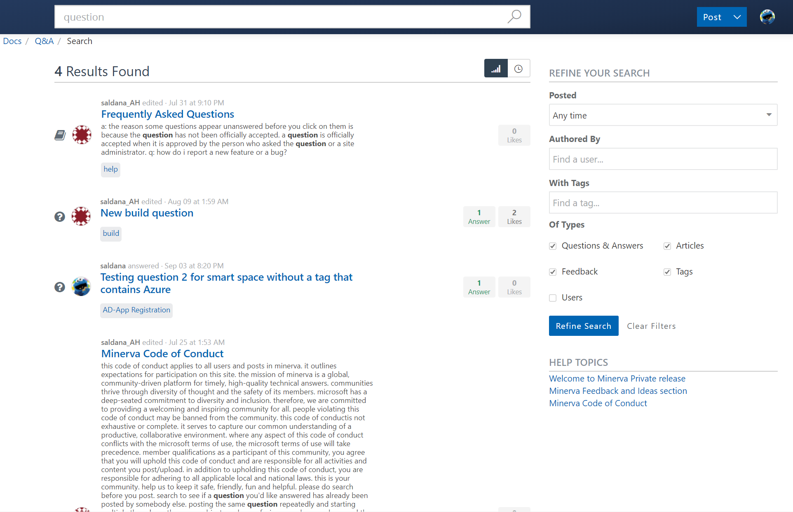
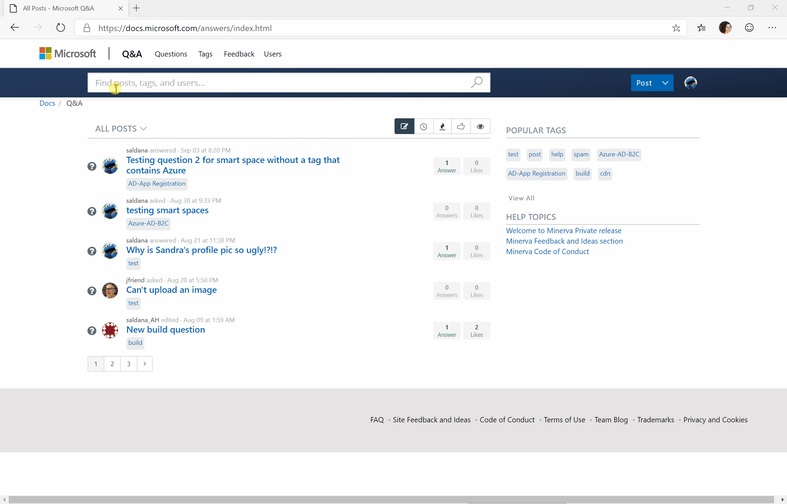
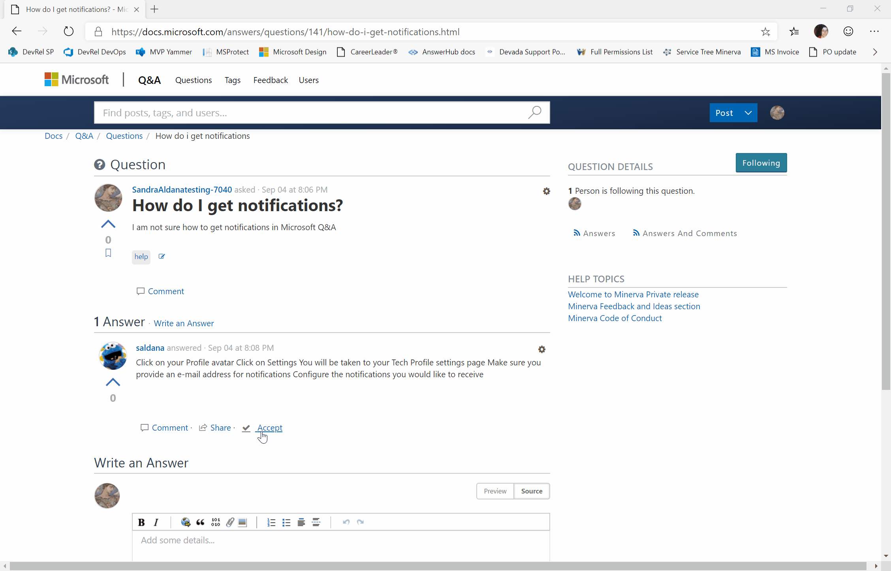
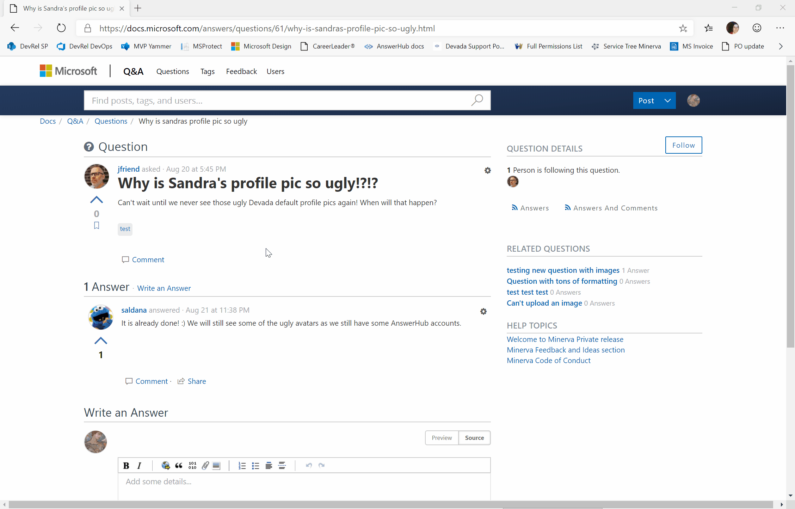
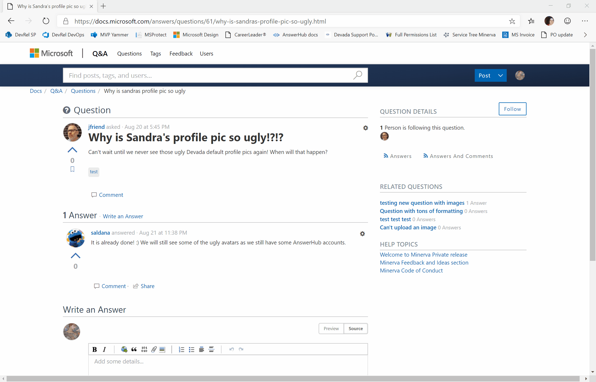

# User Experience for Askers

> [!IMPORTANT]
> All scenarios assume the user is signed in already. See [Sign in Process](index.md#sign-in-process) for the full workflow.

## Asking a Question from Home Page

Click on the "Post" - "Question" option on the blue bar.

The "Ask a Question" page loads.

When entering your question, you will see similar questions already asked by other users. The number on the lef indicates the number of votes, the number on the right, the number of answers the similar question has.

- If you think the question is the same than yours, clicking on it will take you to that question.
- If you do not think any of those questions are what you need, continue entering the question in this page.

In the question body, you can enter all details about your question. In order to get a good answer, be as precise as possible, adding images, files, or code for support. Do not include any confidential information.

Tags are essential in Q&A. Thus, at least a tag is mandatory. You can enter up to 5 tags.

Only Dev Relations' Q&A team can create tags, so you can select from the given tags by typing a character, and you can see a list of the available matches.

Click on the "Post your question" button to publish your question on Microsoft Q&A.

## Asking a Question after Searching in Q&A Site

> [!NOTE]
> Search action does not require you to be signed in.

You might decide to look for questions manually in Q&A before posting. If so, click on the search box on the blue toolbar on the top. You will see that you have some tips on how to look just in certain areas (such as title, or tags). You can see more details about scoped by clicking on the "Advanced Search Tips" link.

As soon as you start typing in the Search box, you will see content matches. The icons indicate whether the content type is a question, article, feedback, etc.

- If you click on any of the hits, it will take you that particular node.
- If you press Enter, it will take you to the results page. In here, you can see more information about all the hits matching your criteria and you can also fine tune your criteria to scope down the results more.

> [!IMPORTANT]
> You might see a discrepancy between the number of results and the actual number of results you see. This might be because you cannot see all site content, such as content in moderation.

Here is an animated gif of the experience:

If you are not satisfied with any of the results, you can ask your question as described in the [Sign in process](index.md#sign-in-process).

## Accepting a Reply

> [!IMPORTANT]
> This scenario assumes that you already asked a question, another user answered your question, and you are going to accept it.

1. Click on the question you asked.
1. Select the reply you feel solves the problem.
1. Click on "Accept".
1. The reply will be labelled with "Accepted Answer" and its background will change to green.

## Voting on a Question

> [!TIP]
> Please vote on a question when another user asked a question related to a problem you have.

> [!NOTE]
> You can only vote once for a given question.

> [!IMPORTANT]
> You can not vote on your own question.

1. Open the question you would like to vote on.
1. Click on the up arrow.
1. To remove your vote, click on the same control

## Voting on an Reply or an Answer

> [!TIP]
> Please vote on an answer or a reply when the user response solves your problem.

> [!NOTE]
> You can only vote once for a given reply or answer.

> [!IMPORTANT]
> You can not vote on your own reply or answer.

