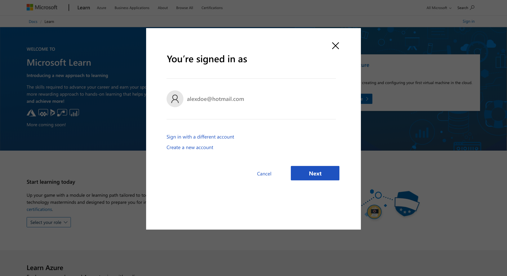
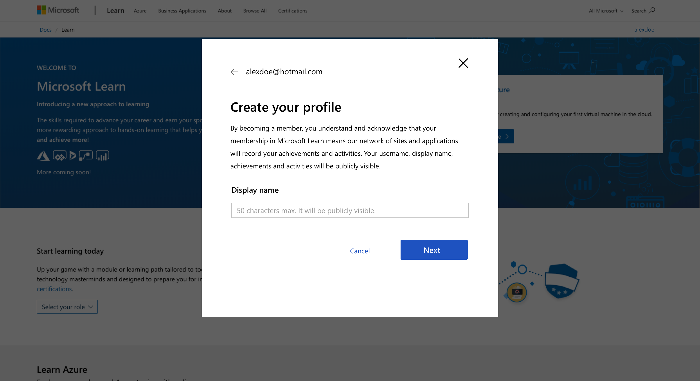
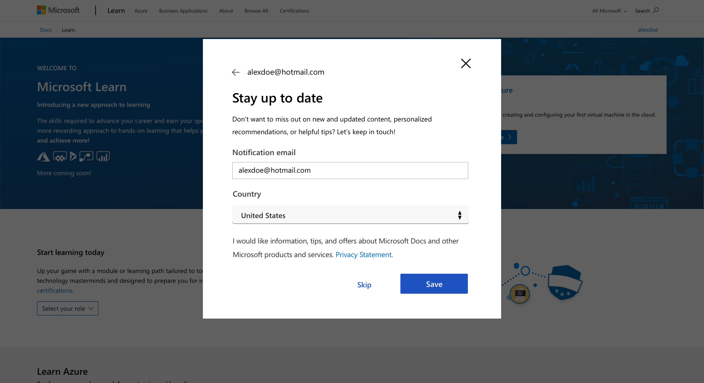
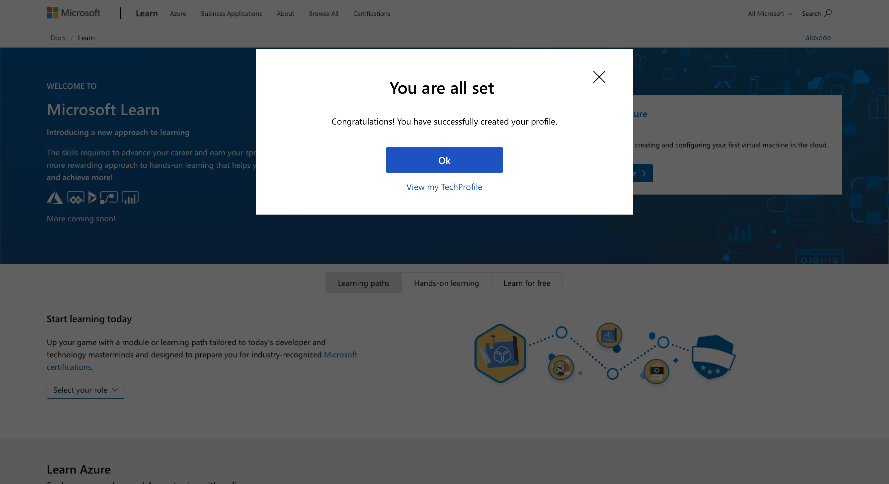

# User Experience Guides

We will focus on 3 key personas' scenarios and their experience:

1. [Askers](asker.md)
1. [Answerers](answerer.md)
1. [Moderators](moderator.md)

> [!IMPORTANT]
> While Askers and Answerers personas focus on different scenarios, the permission level they will have in Microsoft Q&A platform will be the same, as Users. For a full list of permissions, see [Microsoft Q&A permission spreadsheet](https://microsoft.sharepoint.com/:x:/t/CE_APEX/ESBa0UT4rH9AklJPKsHOuNoBToDZKakeXuCIRtBABNtBMA?e=JayYyP)

## Sign in Process

Askers, Answerers, and Moderators need to have a Tech Profile account in order to do any of their key scenarios. Here is the user experience.

> [!TIP]
> We cannot fully test this scenario until Microsoft Q&A is live. We can test it from the [Microsoft Learn](https://docs.microsoft.com/learn) site instead.

1. If you are creating your profile before October 30 go to https://docs.microsoft.com/learn
1. If you are creating your profile after October 30, go to https://docs.microsoft.com/answers
1. Click on the "Sign in" button on the top or attempt to do a write activity, such as ask a question.
1. You will see the sign in process workflow. You can use an existing Microsoft account or create a new account. If you have a Microsoft account, password is auto-populated for you.

- If you already created a Tech Profile account before (for Microsoft Learn or Microsoft Bookmarks), then you are directed back to Microsoft Q&A site (Step 7).
- If you do not have a Tech Profile account associated to your Microsoft account, you see the following screen.

> [!NOTE]
> When Microsoft Q&A is public, the background screen will be Q&A vs. Learn.

5. Clicking on "Next" button, takes you to create your Tech Profile.

6. This step is optional. It allows you to enter your email address to receive notifications. If you provide your email address, you will need to also choose your country, so we can adhere to local privacy policies.

7. Once you move to the next screen, you get a confirmation that the profile has been created correctly.

- Clicking on "OK", takes you back to the page from where you started.
- Clicking on "View my Tech Profile", takes you to your Tech Profile page instead.
