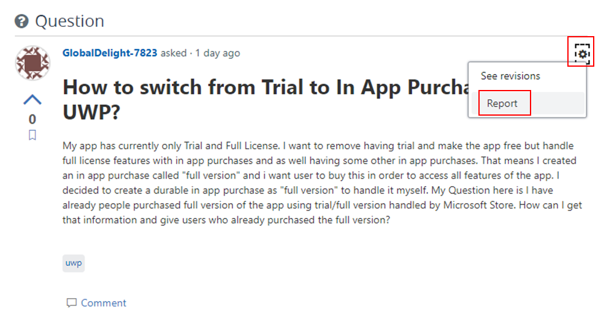
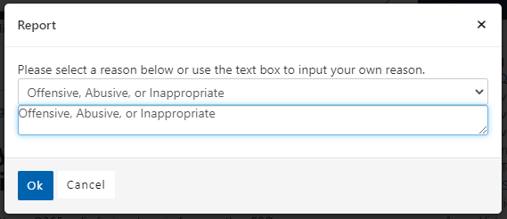
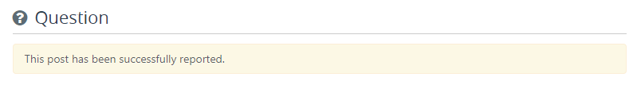

# Report content for moderation review

> [!NOTE]
> This article is targeted to moderators, regular users, and site admins.

You might find content that needs a moderator to review because of the following reasons:

- It is Spam
- It is Advertisement
- It is Offensive, abusive, or inappropriate
- Violates the Code of Conduct
- Violates somebody else's copyright
- It is Misleading
- Someone is not being nice
- It is not relevant or off-topic
- Any other reason

If that is the case, please report it to a moderator for review.

#· Reporting content by regular users

Follow these steps to report the content. Note that the process is the same for reporting questions, answers, comments, or feedback.

1. Click the *Settings/Gear* icon at the right of the content type.
1. Click on the *Report* link.

1. Select a reason for reporting the content from the *Report* dialog drop down. *Spam* is selected by default.
1. If you want to, enter additional comments in the text box.

1. Click *OK* to send the content to the moderator queue.
1. A yellow bar will show on top of the content informing that the content has been reported for moderation review.

Note that the content will continue display on the site while a moderator reviews it.

#· Reporting content by moderators

> [!IMPORTANT]
> It is important you follow these steps if you see content on the site that is spam. If you only delete the content, our spam tools will not know that the content is actual spam m, so spam will continue going undetected.

Follow these steps to report the content. Note that the process is the same for reporting questions, answers, comments, or feedback.

1. Click the *Settings/Gear* icon at the right of the content type.
2. Click on *Delete*.
1. Click the *Settings/Gear* icon again, and click on the *Report* link.
1. Select a reason for reporting the content from the *Report* dialog drop down. *Spam* is selected by default.
1. If you want to, enter additional comments in the text box.
1. Click *OK* to send the content to the moderator queue.
1. Follow the [Spam management](spam-management.md) guidelines to deal with spam that has been sent to the moderation queue.

